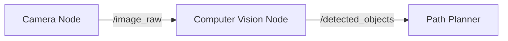

# Topics & Services

## Topics (Pub/Sub)

**Topics** are the primary way data moves in ROS 2.
- **Asynchronous**: Publishers don't know who is listening.
- **Many-to-Many**: One topic can have multiple publishers and subscribers.

## Services (Req/Res)

**Services** are for synchronous calls.
- **Client**: Sends a request (e.g., "Reset Simulation").
- **Server**: Processes and sends a response.
